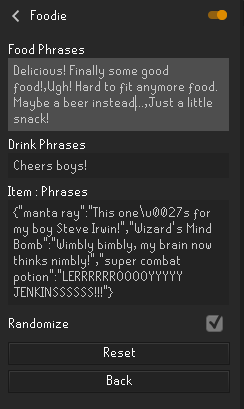

#Configuration

## Food phrases
Food phrases are a comma separated list of phrases that will be chosen randomly upon consumption of a food item. (Unless randomization is false)

Example:

    Delicious! Finally some good food!,Ugh! Hard to fit anymore food. Maybe a beer instead...,Just a little snack

## Drink phrases
Drink phrases are a comma separated list of phrases that will be chosen randomly upon consumption of a drink item. (Unless randomization is false)

Example:

    Cheers boys!, *Smash* Bring me another!

##Item:Phrases
A JSON map of food/drink items to a phrase. When randomize is turned off, only phrases tied directly to the item will be used.

Take a look at the spam chat when consuming a food or drink to help create the key.

Filtered chat when consuming a lobster:

    You eat the lobster.

Example config:

    {"lobster":"You know, lobster used to be considered prisoner food."}

##Randomize
When set to true, all food/drink phrases and specific phrases for an item will be chosen at random when an item or drink is consumed.
When set to false, only specific phrases set by Item:Phrases will be used.